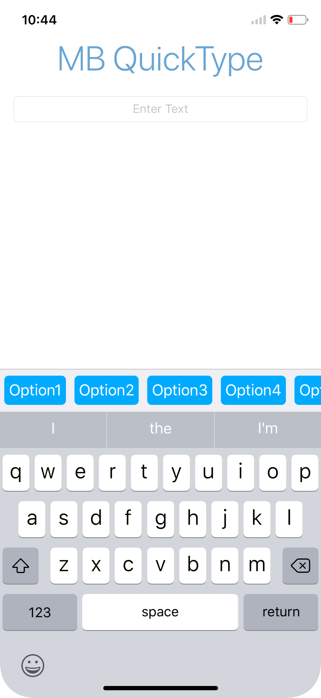

# MB Quick Type
> This is under the MIT license

## Synopsis
MBQuickType is designed to easily present a list of options to the user when entering text. The inspiration for MBQuickType came when I was creating an app that required emails to be entered. Why should users have to add their email domain, when almost everyone has a G-Mail account. Why can't they tap a button and have "@gmail.com" or "gmail.com" appended to their text? Well, now it's easily possible

## Let's Get Started

> I would like to add that this is a very early version, and that I am intending to add many more features to it.
> 
> If you have an idea, please create an issue, and add an `idea` tag

## Variables

* `buttons: [UIButton]` is the array where all the `UIButton` are stored. This is private since you can use any button you want

> Button height should be 30, width should be adaptable.

* `buttonBGColor: UIColor` sets the color for all buttons in the list

> Default is a nice shade of light blue.

* `barBGColor: UIColor` sets the background color

> Default is set to 

## Functions

* `init(withController: UIViewController, inputView: UIView)` is the default initializer.
	* param `withController` is the controller where the button targets are.
	* param `inputView` must be the input view where the keyboard should have MBQuickType as the accessory view.

This document will be updated within the week. Just make sure `renderedView()` is used last. It returns the final view.

	
